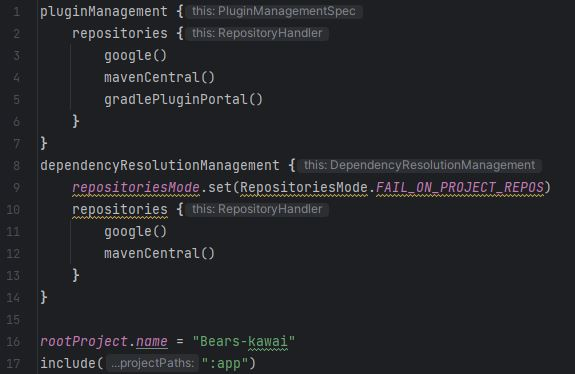
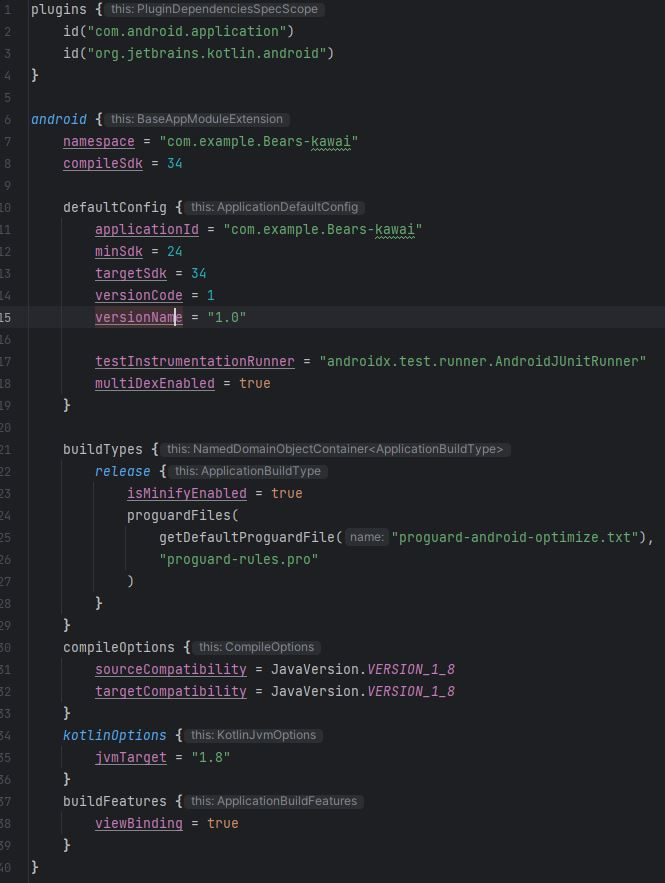

## Android app: web with QR

## Programmed:

 - Kotlin and android studio

## Description:

 - Android application that loads a "webview" with the page that we
   initially indicate in "homeviewmodel", which can later be changed in
   options.
 - Allows you to read QR codes that load only URLs of the page that has
   been specified.
 - In options you can change the default url and if it is accessed
   through a simple "authbasic" form you can set it to send the
   credentials automatically.
 - To enter the options, it is configured to only be able to access if a
   QR code with the word "opciones" is read. (You can chage the word)

## Setting:

The word "bears-kawai" must be changed to the name of the desired       project. It would be in the files:

	strings
	themes
	mobile_navigation
	androidmanifest
	Mainactivity
	qrfragment
	qrcodeprocessor
	optionsfragment
	homeviewmodel
	homefragment

Also, in the "Grade Scripts" files I have them with this    configuration (it is the current one from when I made the app) which    will have to be purchased with your current one:

	settings.gradle.kts:
 
 
	build.gradle.kts (:app): 
 
 
 
	build.grade.kts (bears-kawai): 

 
Import the image that is used as a logo using Android Studio, since this creates all the versions you need.

# Personalization:

 - Change the colors of the app.
 - Change the language of strings and messages.
